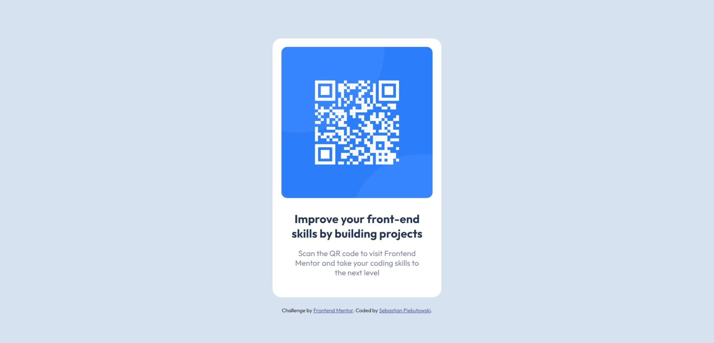

# Frontend Mentor - QR code component solution

## Table of contents

- [Overview](#overview)
  - [Screenshot](#screenshot)
  - [Links](#links)
- [My process](#my-process)
  - [Built with](#built-with)
  - [What I learned](#what-i-learned)
  - [Useful resources](#useful-resources)
- [Author](#author)

## Overview

This is a solution to the [QR code component challenge on Frontend Mentor](https://www.frontendmentor.io/challenges/qr-code-component-iux_sIO_H). Frontend Mentor challenges help you improve your coding skills by building realistic projects.

### Screenshot

### Links

- Solution URL: [CODE](https://github.com/1bi7e/qr-code-component-main)
- Live Site URL: [PREVIEW](https://1bi7e.github.io/qr-code-component-main/)

## My process

For this component I needed only HTML and CSS. I started from building the index.html file by adding all the elements to the site and after that i made a styling with CSS. Styling began with mobile version then i added only max-width to make it responsive for bigger screens.

### Built with

- HTML
- CSS
- Flexbox
- CSS variables

### What I learned

Thanks to this project i had to learn how exactly Flexbox is working and how to place items on the webstie with it. I also dived more into the differences between using diffrent units for spacing like pixels or REM.

### Useful resources

- [Flexbox Guide from CSS-Tricks](https://css-tricks.com/snippets/css/a-guide-to-flexbox/) - This is easy to understand guide for basic Flexbox.

## Author

- Website - [Sebastian Piekutowski](https://github.com/1bi7e)
- Frontend Mentor - [@1bi7e](https://www.frontendmentor.io/profile/1bi7e)
- Twitter - [@bzkttt](https://twitter.com/bzkttt)